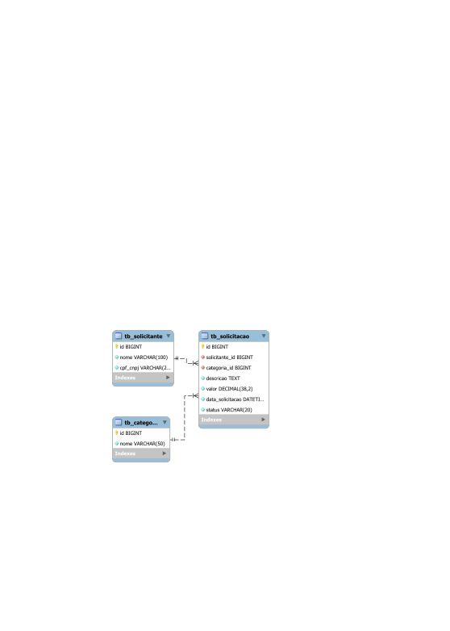
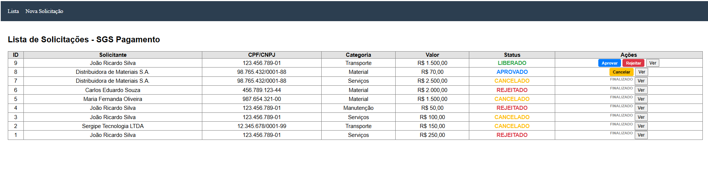

# SGS Pagamento — Sistema de Gestão de Solicitações

[](https://openjdk.org/)
[](https://spring.io/projects/spring-boot)
[](https://react.dev/)
[](https://www.mysql.com/)

O **SGS Pagamento** é um Sistema de Gestão de Solicitações (SGS) desenvolvido como desafio técnico para a vaga de **Programador de Sistemas de Computação**. A aplicação automatiza, organiza e controla o fluxo de solicitações de pagamento realizadas por diferentes áreas de uma organização, substituindo processos manuais por uma plataforma web dotada de total rastreabilidade e controle rígido de transição de estados.

---

## Decisões Técnicas & Arquitetura

O projeto foi edificado seguindo o padrão de **arquitetura em camadas** (`Controller -> Service -> Repository -> Banco de Dados`), garantindo alta coesão e baixo acoplamento:

> **Fluxo de Dados:**
> Controller (HTTP/REST) ➔ Service (Regras/Estados) ➔ Repository (SQL Nativo) ➔ Banco de Dados

### Por que essas tecnologias e padrões foram escolhidos?

*   **Spring Boot (4.0.6) & Java 21:** Escolhido pela alta produtividade do ecossistema e robustez na construção de APIs RESTful. A utilização de Java 21 permitiu o uso de **Records** para a modelagem dos DTOs, garantindo imutabilidade nata dos dados.
*   **React + Vite:** Utilizados no frontend para conceber uma Single Page Application (SPA) leve, performática, de renderização veloz e fácil manutenção.
*   **Desacoplamento Absoluto com DTOs & Projections:** O modelo de dados do banco nunca é exposto diretamente na API. Usamos `SolicitacaoRequestDTO` e `StatusRequestDTO` na entrada de dados, e `SolicitacaoDTO` na saída, protegendo o domínio da aplicação.
*   **Uso Otimizado de Native Query:** Para atender às especificações de performance do desafio técnico, as buscas filtradas operam via query nativa otimizada no banco de dados. Em conjunto, o uso de uma **Interface Spring Projection** (`SolicitacaoProjection`) evitou o carregamento lento ou parcial (*N+1 selects*) das entidades do Hibernate.
*   **Tratamento Global de Exceções (`@ControllerAdvice`):** Centraliza o tratamento de falhas do sistema, convertendo exceções comuns em respostas HTTP amigáveis e tipadas para a interface.
*   **Controle Transacional Rigoroso:** Métodos de modificação de estado de escrita utilizam a anotação `@Transactional` do Spring, garantindo o princípio ACID e *rollback* automático caso ocorram inconsistências.

---

## Fluxo e Máquina de Estados (Regras de Negócio)

Para blindar o faturamento contra fraudes ou erros operacionais, o fluxo de transição de status segue uma lógica unidirecional restrita, validada na camada `Service` através de um `Enum`:

*   **Estado Inicial Mandatório:** `SOLICITADO`
*   **Estados Finais (Imutáveis):** `REJEITADO` e `CANCELADO` (Após atingirem este estado, nenhuma outra alteração é permitida).

### Transições Permitidas:
*   `SOLICITADO` ➔ `LIBERADO`
*   `SOLICITADO` ➔ `REJEITADO`
*   `LIBERADO` ➔ `APROVADO`
*   `LIBERADO` ➔ `REJEITADO`
*   `APROVADO` ➔ `CANCELADO`

---

## Estrutura do Repositório
```text
sgs-pagamento/
│
├── backend/				# Código-fonte da API Spring Boot
│   ├── src/main/java/com/sgs
│   │   ├── controller			# Endpoints REST e HTTP
│   │   ├── dto				# Records de transferência de dados
│   │   ├── exception			# Handlers e exceções customizadas
│   │   ├── model			# Entidades JPA e Enums
│   │   ├── repository			# Interfaces de acesso ao banco (Queries)
│   │   └── service			# Camada lógica e regras de status
│   └── src/main/resources
│       └── application.properties	# Arquivo de propriedades do Spring
│
├── frontend/				# Código-fonte do cliente SPA React
│   ├── src
│   │   ├── components			# Componentes de interface (Formulários)
│   │   ├── services			# Configurações do Axios (API)
│   │   └── pages			# Telas principais (Listagem/Filtros)
│
├── sql/				# Scripts SQL de migração e sementes
│   ├── 01_ddl_schema.sql		# Definição das estruturas relacionais
│   └── 02_dml_insert.sql		# Dados fictícios para teste do ecossistema
│
└── README.md				# Documentação do projeto
```

## Modelagem do Banco de Dados & Scripts

O Hibernate está configurado em modo de validação rigorosa corporativa:
```properties
spring.jpa.hibernate.ddl-auto=validate
```
Isso impede que o framework altere ou crie tabelas dinamicamente, exigindo que o banco de dados seja instanciado pelos scripts abaixo.
<p align="center">
  
</p>
### Relacionamentos:
* Solicitante (1:N) Solicitação
* Categoria (1:N) Solicitação

##  1. DDL — Criação do Schema (sql/01_ddl_schema.sql)
```sql
CREATE DATABASE IF NOT EXISTS db_sgs_pagamento;
USE db_sgs_pagamento;

CREATE TABLE IF NOT EXISTS tb_solicitante (
    id BIGINT AUTO_INCREMENT PRIMARY KEY,
    nome VARCHAR(100) NOT NULL,
    cpf_cnpj VARCHAR(20) NOT NULL UNIQUE
);

CREATE TABLE IF NOT EXISTS tb_categoria (
    id BIGINT AUTO_INCREMENT PRIMARY KEY,
    nome VARCHAR(50) NOT NULL
);

CREATE TABLE IF NOT EXISTS tb_solicitacao (
    id BIGINT AUTO_INCREMENT PRIMARY KEY,
    solicitante_id BIGINT NOT NULL,
    categoria_id BIGINT NOT NULL,
    descricao TEXT NOT NULL,
    valor DECIMAL(10, 2) NOT NULL,
    data_solicitacao DATETIME NOT NULL,
    status VARCHAR(20) NOT NULL,
    CONSTRAINT fk_solicitacao_solicitante FOREIGN KEY (solicitante_id) REFERENCES tb_solicitante(id),
    CONSTRAINT fk_solicitacao_categoria FOREIGN KEY (categoria_id) REFERENCES tb_categoria(id)
);
```
##  2. DML — Inserções Iniciais (sql/02_dml_insert.sql)
```sql
USE db_sgs_pagamento;

INSERT INTO tb_categoria (nome) VALUES
('Serviços'), ('Material'), ('Transporte'), ('Manutenção'), ('Diárias');

INSERT INTO tb_solicitante (nome, cpf_cnpj) VALUES
('João Ricardo Silva', '123.456.789-01'),
('Maria Fernanda Oliveira', '987.654.321-00'),
('Carlos Eduardo Souza', '456.789.123-44'),
('Sergipe Tecnologia LTDA', '12.345.678/0001-99'),
('Distribuidora de Materiais S.A.', '98.765.432/0001-88');
```
##  Query Nativa Otimizada
Mapeada diretamente no SolicitacaoRepository, trata filtros opcionais através de condições de anulação lógica e ordena de forma decrescente:
```sql
SELECT s.id,
       sol.nome AS nomeSolicitante,
       sol.cpf_cnpj AS documento,
       cat.nome AS nomeCategoria,
       s.descricao,
       s.valor,
       s.data_solicitacao AS dataSolicitacao,
       s.status
FROM tb_solicitacao s
INNER JOIN tb_solicitante sol ON s.solicitante_id = sol.id
INNER JOIN tb_categoria cat ON s.categoria_id = cat.id
WHERE (:status IS NULL OR s.status = :status)
AND (:categoriaId IS NULL OR cat.id = :categoriaId)
AND (:dataInicio IS NULL OR s.data_solicitacao >= :dataInicio)
AND (:dataFim IS NULL OR s.data_solicitacao <= :dataFim)
ORDER BY s.id DESC
```
# Interface da Aplicação

## Listagem de Solicitações

A tela principal permite visualizar todas as solicitações cadastradas, incluindo:

- status atual
- solicitante
- categoria
- valor
- ações disponíveis
- filtros dinâmicos

<p align="center">
  
</p>

---

## Cadastro de Nova Solicitação

A aplicação permite registrar novas solicitações de pagamento vinculando solicitante, categoria, descrição e valor.

<p align="center">
  
</p>

---

## Detalhamento da Solicitação

O sistema possui visualização detalhada da solicitação através de modal contendo informações completas da operação.

<p align="center">
  
</p>

---

## Documentação da API (Principais Endpoints)
### Solicitações
*   **GET /api/solicitacoes** — Retorna a lista de solicitações ordenada por ID de forma decrescente.

Parâmetros opcionais de busca: status, categoriaId, inicio, fim.

Exemplo de busca por período: /api/solicitacoes?inicio=2026-05-01T00:00:00&fim=2026-05-10T23:59:59

*   **GET /api/solicitacoes/{id}** — Busca detalhada de um único registro.

*   **POST /api/solicitacoes** — Criação de uma nova solicitação.

*   *Payload:*
```json
{
  "solicitanteId": 1,
  "categoriaId": 2,
  "descricao": "Pagamento de fornecedor",
  "valor": 1500.00
}
```

*   **PUT /api/solicitacoes/{id}/status** — Atualiza o status da transição via corpo de requisição (`@RequestBody`).
*   *Payload:*
```json
{
  "novoStatus": "LIBERADO"
}
```
### Estrutura Padronizada de Erros (Capturada pelo Handler)
```json
{
  "status": 400,
  "message": "Transição de status não permitida",
  "timestamp": 1747340000000
}
```

## Como Executar a Aplicação
### Pré-requisitos

Java 21 SDK
Node.js (versão estável LTS)
Maven 3.x+
Banco de Dados MySQL ativo na porta 3306

### 1. Configuração de Variável de Ambiente

Para proteger as credenciais de acesso locais ao banco de dados, insira sua senha na variável ${DB_PASSWORD} exigida no application.properties:
Windows (PowerShell): $env:DB_PASSWORD="sua_senha_aqui"
Linux / macOS: export DB_PASSWORD="sua_senha_aqui"

### 2. Rodando o Backend
```bash
 cd backend
 mvn clean install
 mvn spring-boot:run
```
 **API ativa em:  *http://localhost:8080***

 ### 3. Rodando o Frontend
 ```bash
 cd frontend
 npm install
 npm run dev
```
**Interface ativa em: http://localhost:5173**

## Próximas Implementações (Melhorias Futuras)
* [ ] Implementação de Segurança com Camada de Autenticação e Autorização (Spring Security + JWT).

* [ ] Paginação na consulta de listagem para otimizar transferência em volumes massivos de dados.

* [ ] Dockerização completa da aplicação com docker-compose.

* [ ] Ampliação da cobertura de testes com testes unitários e de integração utilizando JUnit5 e Mockito.

* [ ] Sistema de Auditoria de Ações com logs estruturados.
---

Desenvolvido por Ryan Ricardo - Desafio para Programador de Sistemas de Computação.
